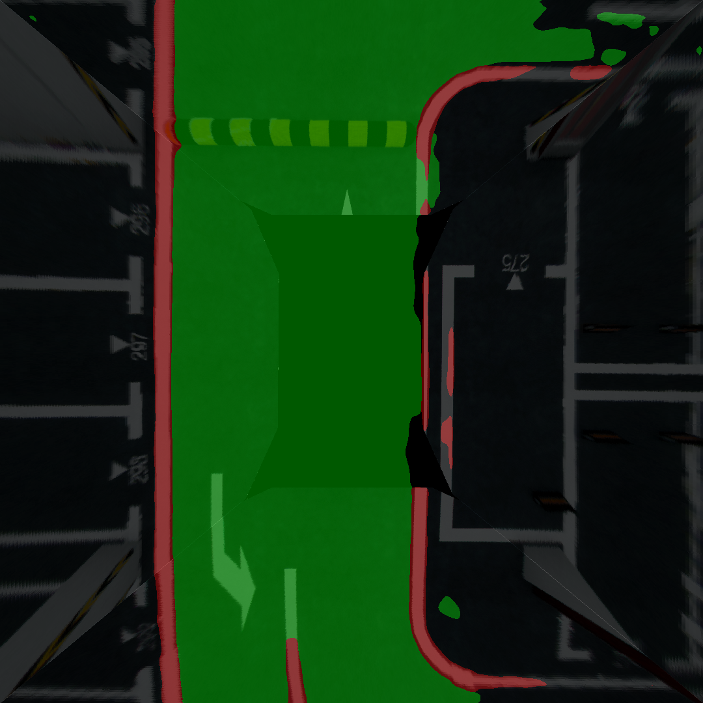
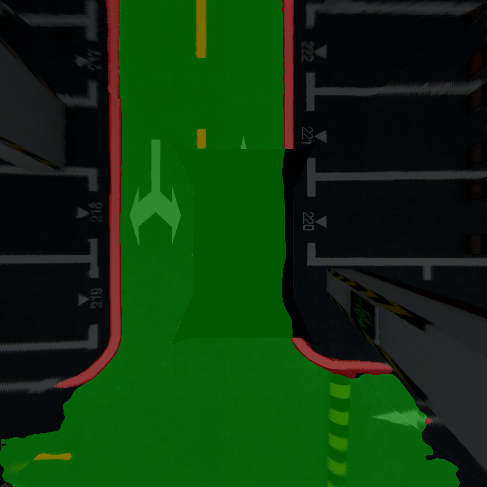
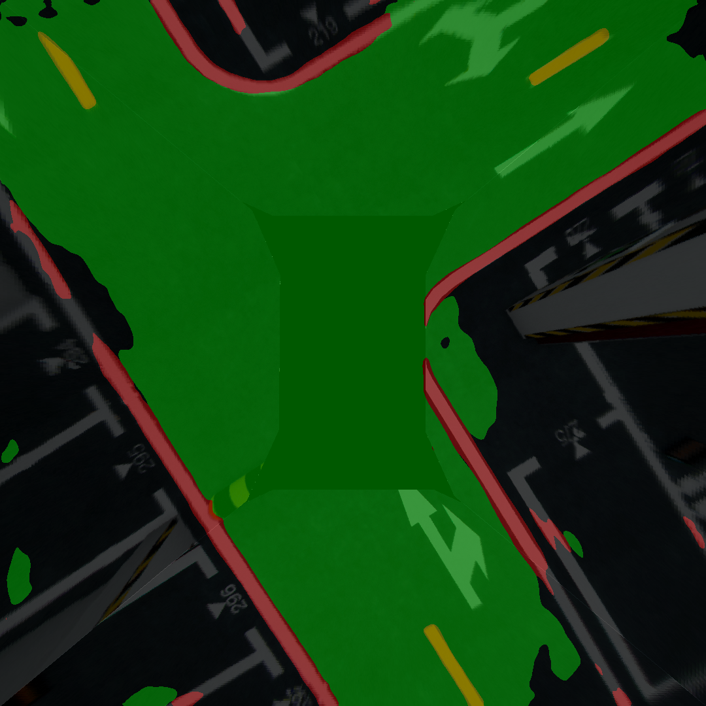

# BEV-Segment
BEV detection project segments drivable area, lane edge and middle line in the BEV image generated from 4 carla fisheye cameras. Here are some results of the BEV segmentation. The green area is the drivable area, the red is the lane edge, and the yellow is middle line.

<figure class="third">
       
</figure>

# Get Started
1. install dependency, refer to [README-origin.md](README-origin.md)
2. run the inference.
```shell
activate conda virtual environment
python3 predict.py
```


